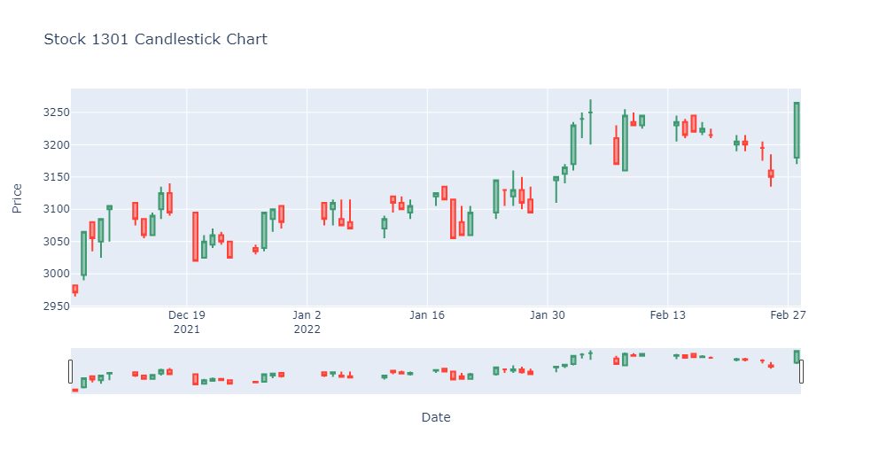
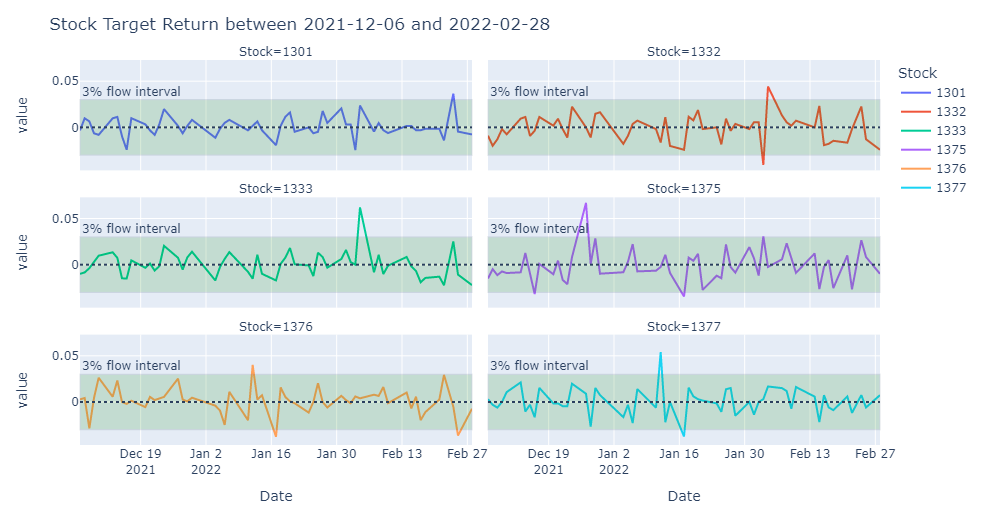

# JPX
kaggle: https://www.kaggle.com/competitions/jpx-tokyo-stock-exchange-prediction/data
## data clean 
**(plot by [plotly]([url](https://plotly.com/python/)))**
#### Candlestick image
```
fig = go.Figure(data=[go.Candlestick(
                    x=stock_1301['Date'], open=stock_1301['Open'],
                    close=stock_1301['Close'], high=stock_1301['High'],
                    low=stock_1301['Low'], 
                    )])
fig.update_layout(
    title='Stock 1301 Candlestick Chart',
    xaxis_title='Date',
    yaxis_title='Price'
)
fig.show()
```

#### Lines image
```
fig = px.line(six_stocks, facet_col='Stock', facet_col_wrap=2)
fig.add_hrect(
    y0=-0.03, y1=0.03, fillcolor='green', opacity=0.15, line_width=1,
    annotation_text='3% flow interval',
    annotation_position='outside top left'
)
fig.add_hline(
    y=0, line_dash='dot',
)
fig.update_layout(
    title='Stock Target Return between 2021-12-06 and 2022-02-28'
)
fig.show()
```

